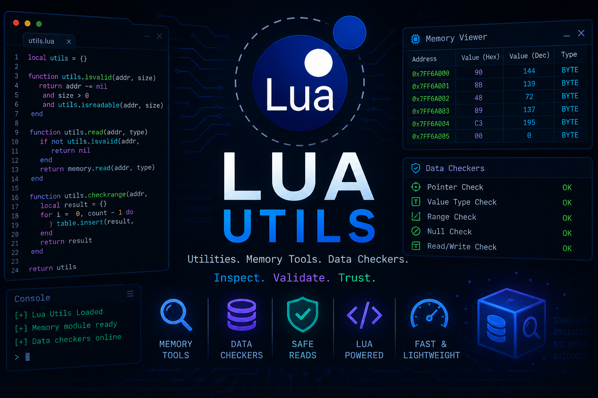

# helobro5: 

A collection of random Lua scripts, experiments, utilities, and projects I’ve made over time.

### About

This repository is mostly a dump of Lua code I’ve written while learning, testing ideas, and working on various projects. Some scripts may be useful, some may be unfinished, and some are just random experiments.

### Contents

* Utility functions
* Game-related scripts
* Code snippets
* Testing projects
* Miscellaneous Lua experiments

### Notes

Most files are provided as-is and may not be actively maintained. Expect inconsistent quality, weird ideas, and occasional unfinished code.

### Disclaimer

Everything in this repository is intended for educational and research purposes. Use any code responsibly and ensure it complies with the rules, terms of service, and laws applicable to your platform.

### Contributing

Feel free to open issues, suggest improvements, or submit pull requests.

⸻

**“If it works, it stays. If it breaks, it stays.”**
